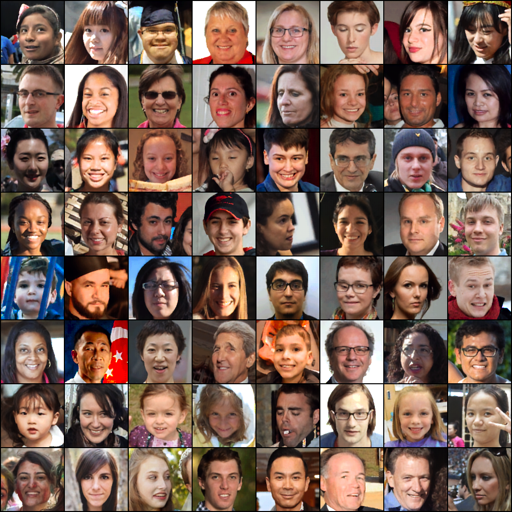

# VQVAE-Toy-Implementation
A stolen implementation of VQVAE for study.

Implementation from [here](https://github.com/bshall/VectorQuantizedVAE)

## Results
Trained for 4000 training steps with batch size of 32. I've used the FFHQ dataset. Default parameters. Embedding size of (256, 32, 32).

## Why?
I need to understand VQVAEs for a personal project and I've found a cool implementation. Now I've understood VQVAEs and I'm a happier person overall.
